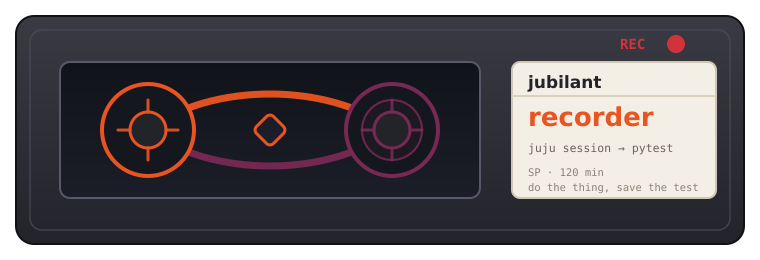

# jubilant-recorder



[](https://github.com/tonyandrewmeyer/jubilant-recorder/actions/workflows/ci.yaml)
[](LICENSE)
[](https://www.python.org/downloads/)

Record a live jubilant session and replay it as a pytest integration test.

> **Status: alpha.** The generated tests are useful today, but the session-log
> schema and the gesture API may still change between releases. This is a
> personal project, not an official Canonical product.

`jubilant-recorder` wraps `jubilant.Juju`, captures every CLI call plus a
lightweight model snapshot before and after, and turns the resulting session
log into an idiomatic pytest test file. The intent is to collapse integration
test authoring from "an hour of careful translation" to "do the thing, save
the test."

## What it does

You drive a deployment once, by hand or in a script. It writes the test.

Record:

```python
from jubilant_recorder import RecordingJuju, assert_status, checkpoint

with RecordingJuju.start("session.json", model="my-model") as juju:
    juju.deploy("ubuntu", channel="stable")
    juju.wait(jubilant.all_active)
    assert_status("ubuntu", "active")
    checkpoint("deployed")
```

Generate:

```bash
jubilant-recorder generate session.json --out test_demo.py
```

Get:

```python
import jubilant


def test_recorded_session():
    with jubilant.temp_model() as juju:
        juju.deploy("ubuntu", channel="stable")
        assert len(juju.status().apps["ubuntu"].units) == 1
        juju.wait(jubilant.all_active, timeout=900)
        for _u in juju.status().apps["ubuntu"].units.values():
            assert _u.workload_status.current == "active"
        # checkpoint: deployed
```

The [full walkthrough](docs/demo.md) shows all three recording modes end to end.

## Install

```bash
uv add jubilant-recorder            # or: pip install jubilant-recorder
```

Requires Python 3.11+ and `jubilant>=1.0`. To record libjuju-driven sessions
as well, install the extra:

```bash
uv add 'jubilant-recorder[libjuju]'
```

## Three ways to record

| Mode | Use it when | Docs |
|---|---|---|
| **Scripted** — wrap `jubilant.Juju` in `RecordingJuju` | you are writing the deployment in Python anyway | below |
| **Shell capture** — `jtr`, a PATH shim plus a shell hook | you are working at a real prompt, typing `juju` commands | [docs/shell-hook.md](docs/shell-hook.md) |
| **libjuju** — a tap on `Connection.rpc` | you have an existing libjuju suite to migrate | [docs/libjuju.md](docs/libjuju.md) |

All three produce the same session-log format, so the tagger and codegen are
shared. The schema is documented in [docs/schema.md](docs/schema.md).

## Gesture API

The recorder captures every jubilant call, but the codegen is conservative
about what to assert. Call the gesture API from your recording script to
emit explicit assertions that survive into the generated test.

```python
from jubilant_recorder import (
    RecordingJuju,
    assert_action_result,
    assert_status,
    checkpoint,
)

with RecordingJuju.start("session.json") as juju:
    juju.deploy("my-charm", channel="edge")
    juju.wait_for_idle()
    assert_status("my-charm", "active")
    checkpoint("deployed")

    juju.run("my-charm/0", "do-thing", {"key": "val"})
    assert_action_result("latest", key="output", value="done")
```

Available calls:

| Call | What it does |
|---|---|
| `checkpoint(name, *, comment=None)` | Inject a checkpoint event. Renders as a `# checkpoint: <name>` comment in the generated test, used to delineate phases. |
| `assert_status(app=None, status=None, message=None, *, unit=None)` | Snapshot model status and emit an explicit `assert juju.status()…workload_status == <status>` line. With no args, emits a `# TODO: tighten this assertion` placeholder. |
| `assert_action_result(action_id, *, key=None, value=None)` | Attach an assertion to the most recent `juju.run(...)` event. Pass `"latest"` as `action_id`; codegen renders `assert result_<seq>.results[<key>] == <value>`. |

All gesture calls require an active `RecordingJuju.start(...)` context. Calling
one outside raises `RuntimeError`.

## CLI

The `jubilant-recorder` command provides four subcommands:

| Subcommand | Description |
|---|---|
| `jubilant-recorder start [--session-log PATH] [--model NAME]` | Begin a recording session. Writes `{pid, session_log_path, model, started_at}` to `$XDG_CACHE_HOME/jubilant-recorder/active.json` (or `~/.cache/jubilant-recorder/active.json`). Prints the session log path to stdout. |
| `jubilant-recorder stop` | Read the state file, finalise the session log if necessary, remove the state file. |
| `jubilant-recorder run [--session-log PATH] [--out TEST.py] [--name NAME] [--ai] [--ai-model MODEL] [-- CMD ARGS…]` | All-in-one: start a session, run `CMD` under the recorder (or `$SHELL` if no command given), stop, and generate a test alongside the session log. |
| `jubilant-recorder generate SESSION_LOG [--out TEST.py] [--name TEST_NAME] [--ai] [--ai-model MODEL]` | Pure post-processing: read a completed session log, run the tagger over it, and produce a pytest test file. |

`jubilant-recorder run` exports `JUBILANT_RECORDER_SESSION_LOG` into the
child process environment so user scripts can locate the active log.

## Session logs and secrets

A session log records the arguments and results of every operation, which
means it can capture whatever your charms hand back — action results,
relation data, and in shell-capture mode the command lines you typed.

The recorder redacts as it writes: values under keys like `password`,
`token`, `secret` and `credential`, bearer tokens, and credentials embedded
in URLs of any scheme are replaced with a `<redacted:…>` marker. In
shell-capture mode you can add your own patterns with `jtr redact PATTERN`.

Redaction is a safety net, not a guarantee. **Read a session log before you
commit it or attach it to a bug report.**

## LLM features (`--ai`)

Both `run` and `generate` accept an `--ai` flag that enables two
independent LLM passes (off by default):

### (1) Tagger: LLM-augmented assertion inference

After the deterministic delta-based tagger runs, a second pass sends the
full session log to an LLM and asks *"what was the user verifying at each
step?"* Its suggestions are added as additional `source: "llm"`
assertion tags alongside the deterministic `source: "delta"` ones. This
can catch implicit checks (user read the action output → assert result
contains a key) that the rule-based tagger misses.

Safety rail: any LLM-proposed assertion that references an app, unit, or
event not present in the session log is silently dropped with a warning,
so hallucinations never reach the generated test.

### (2) Codegen: LLM polish pass

After the test file is produced deterministically, a second pass sends it
to an LLM asking for readability improvements: a meaningful test name, a
one-line docstring per logical step, and collapsing of redundant idempotent
calls (`status`, `wait_for_idle`). The orchestrator verifies the polished
code still parses and preserves the behavioural juju call sequence; if not,
it discards the polished version and returns the deterministic output.

**Experimental — review the generated assertions and test name before committing.**

### OpenRouter API key

Both LLM passes go through [OpenRouter](https://openrouter.ai)'s
OpenAI-compatible API, defaulting to `anthropic/claude-sonnet-5`. Set the
environment variable before running:

```bash
export OPENROUTER_API_KEY=sk-or-v1-...
jubilant-recorder generate session.json --ai
```

If `OPENROUTER_API_KEY` is not set, a warning is printed and both passes fall
back to their offline stubs (deterministic output, no network calls, no crash).

To use a different model, either set `OPENROUTER_MODEL` or pass
`--ai-model`, which takes priority:

```bash
jubilant-recorder generate session.json --ai --ai-model openai/gpt-5.2
```

The two LLM passes share a single `httpx.Client` instance per invocation, so
only one connection pool is established per `generate`/`run` call.

## Repo layout

```
src/jubilant_recorder/              the package
  codegen/                          session log -> pytest source
  tagger/                           assertion inference
  shim/                             the `juju` PATH shim
  extensions/libjuju/               the libjuju recording front-end
tests/                              unit suite + fixture session logs
tests/e2e/                          end-to-end tests, need a real controller
examples/                           live recording scripts
docs/                               schema, demo, and per-mode guides
```

## Development

```bash
uv sync --extra dev --extra libjuju
uv run pytest
uv run ruff check
uv run pyright
```

The unit suite needs no Juju controller. The end-to-end tests do, and are
deselected unless you ask for them:

```bash
uv run pytest tests/e2e --e2e
```

See [CONTRIBUTING.md](CONTRIBUTING.md).

## Licence

Copyright 2026 Tony Meyer, under Apache-2.0. See [`LICENSE`](LICENSE).
